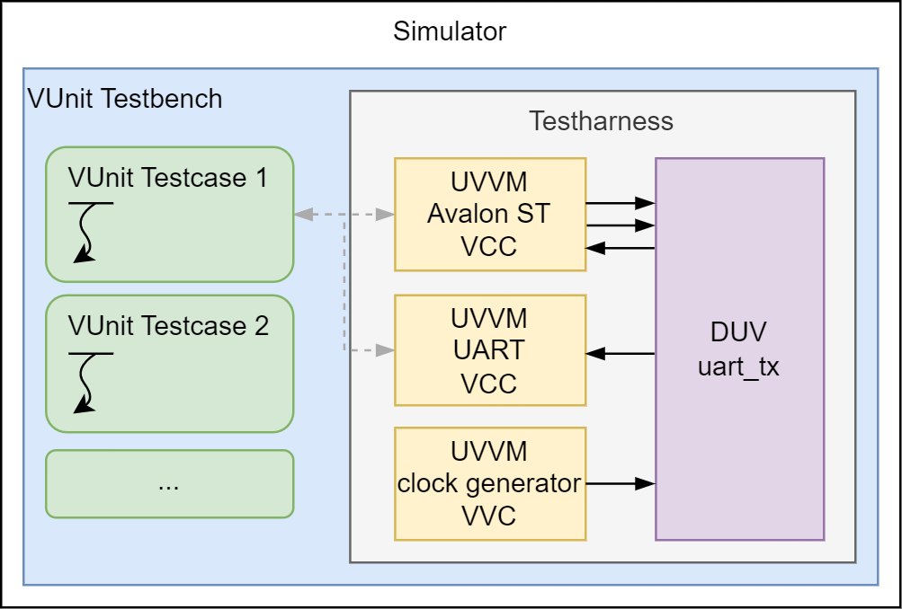

# Combining VUnit & UVVM


This sample project demonstrates how [VUnit](https://github.com/VUnit/vunit) and [UVVM](https://github.com/UVVM/UVVM) can be combined in a unified verification environment.  
Developed and maintained by [P2L2](https://p2l2.com), this public example demonstrates a UART transmitter testbench that utilizes the VUnit regression runner in combination with UVVM’s Verification Components and Framework.



---

### Architecture

#### VUnit Testbench
The testbench is organized to run multiple test cases (e.g., `VUnit Testcase 1`, `VUnit Testcase 2`, etc.) using VUnit’s powerful Python-based test runner.

#### UVVM Test Harness
The test harness manages and orchestrates the following UVVM Verification Components (VVCs):

- **Avalon-ST Source VVC**  
  Sends data to the DUT using the Avalon Streaming interface.
  
- **UART RX VVC**  
  Acts as a UART receiver, validating the transmitted data.
  
- **Clock Generator VVC**  
  Provides the clock signal required for synchronous operation.
  
- **Device Under Test (DUT)**  
  The DUT is a simple UART transmitter (`uart_tx`) which accepts input via an Avalon-ST interface and outputs data over UART.

## Getting Started

### Prerequisites

- **Python**: Version 3.8 or higher  
- **Git**: For cloning with submodules  
- **VHDL simulator**: Compatible with VUnit (e.g., [NVC](https://github.com/nickg/nvc), [GHDL](https://github.com/ghdl/ghdl), ModelSim, Riviera Pro, ...)
---

## Installation

### 1. Clone the Repository (including submodules)

```bash
git clone --recurse-submodules https://github.com/p2l2/Combining_VUnit_and_UVVM.git
```

If already cloned:

```bash
git submodule update --init --recursive
```

---

### 2. Install Dependencies

Running [initial_setup.sh](./initial_setup.sh) will automatically install all dependencies. Alternatively, if you prefer to install them manually, here is a list of the required dependencies:

#### VUnit

This example uses the development version `5.0.0.dev6`. To install:

```bash
python -m pip install vunit_hdl==5.0.0.dev6
```

> **Note**: You can also use the latest stable version (e.g., `4.7`). Minor adjustments to `run.py` might be necessary.

#### VUnit Helpers

```bash
python -m pip install vunit_helpers
```

## Running the Example

After installing all dependencies and initializing the submodules, you can run the testbench using the `run.py` script located in the `verification` directory:

```bash
cd verification
python run.py
```

> This will launch VUnit, compile all VHDL sources, and execute the test cases defined in `run.py`.


To run a specific test case and open it in the simulator GUI (if supported), use:

```bash
python run.py *single_byte* --gui
```

If **ModelSim/Questa** or **NVC** is not installed or not available in your environment, you must modify `run.py` to set the desired simulator explicitly.
You can select the simulator in the following lines of the run.py: 
```python
# #############################################
# VUnit Simulator Selection
# #############################################
# use modelsim for debugging per default
if ("-g" in sys.argv) or ("--gui" in sys.argv):
    prj.simulator = "modelsim"
else:
    ## use NVC per default on windows
    prj.simulator = "nvc"
    ## some other supported simulators: ghdl, activehdl, rivierapro, modelsim
```

## License
This project is open-source and provided as-is for educational and demonstration purposes. See the LICENSE file for more information.

---

## Author & Contact

Developed by [P2L2](https://p2l2.com).  
For questions or contributions, feel free to open an issue or pull request.
